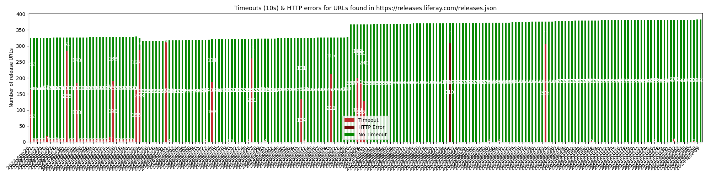

# Liferay DXP Releases

Mirror all Liferay DXP Tomcat bundles found in [releases.json](https://raw.githubusercontent.com/lgdd/liferay-product-info/main/releases.json) as GitHub releases in this repository.

## Usage

Sometimes `releases-cdn.liferay.com` is slow or unresponsive which has an impact in Liferay workspaces when running the `initBundle` command with Gradle or `bundle-support:init` with Maven.

With this mirroring, you can now use URLs from the [releases section](https://github.com/lgdd/liferay-dxp-releases/releases) as a fallback for downloading the bundle by editing the `gradle.properties`. For example:

```properties
liferay.workspace.product=dxp-2024.q1.5
liferay.workspace.bundle.url=https://github.com/lgdd/liferay-dxp-releases/releases/download/dxp-2024.q1.5/liferay-dxp-tomcat-2024.q1.5-1712566347.tar.gz
```

For Liferay Portal (CE), you can refer to the [official GitHub repository](https://github.com/liferay/liferay-portal/releases):

```properties
liferay.workspace.product=portal-7.4-ga112
liferay.workspace.bundle.url=https://github.com/liferay/liferay-portal/releases/download/7.4.3.112-ga112/liferay-ce-portal-tomcat-7.4.3.112-ga112-20240226061339195.tar.gz
```

> [!NOTE]
> Releases in this repository might not be sorted in a chronological order. Make sure to use the search bar to find the edition and version you're looking for.

## Timeouts & HTTP errors

At the time of building this, `releases-cdn.liferay.com` is so unstable that I had to increase requests timeout from 10s to 120s to make sure that I don't miss a release.

But since 10s is already huge for getting one of those static pages, I decided to update a report every day using GitHub Actions:



> [!NOTE]
> The [script](report.py) requests all the URLs from the [releases.json](https://raw.githubusercontent.com/lgdd/liferay-product-info/main/releases.json) file, [once a day](.github/workflows/create-releases.yml#L8) at noon (UTC time). It does not represent the average of timeouts & HTTP errors in a day.